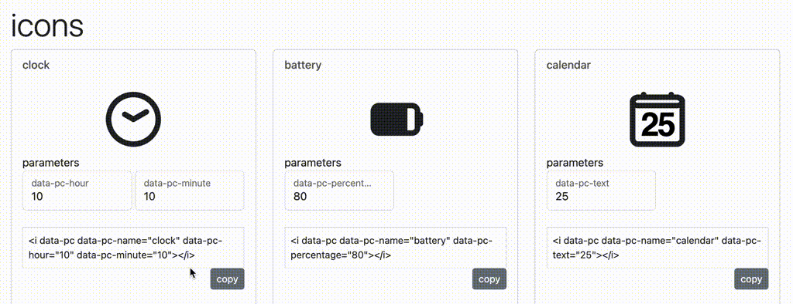

# picon
Picon is a parametric SVG icon generator that can be easily used with just html tags, such as i, svg or js.
PICON is still in beta version and is subject to frequent changes and modifications. If you have any comments or suggestions, please submit them to the github issue.

  * https://tetsuakibaba.github.io/picon/

## How to add your original picon
 1. add your original picon code to picon_dfaults in picon.js
 2. add your original picon code to picon class constructor in picon.js
 3. add your original picon function (createSVGYourOrigianlPiconName) in picon.js
 4. add your original picon code in LoadPiconTag() in picon.js

# Reference
  * SVG Tutorial, https://developer.mozilla.org/ja/docs/Web/SVG/Tutorial